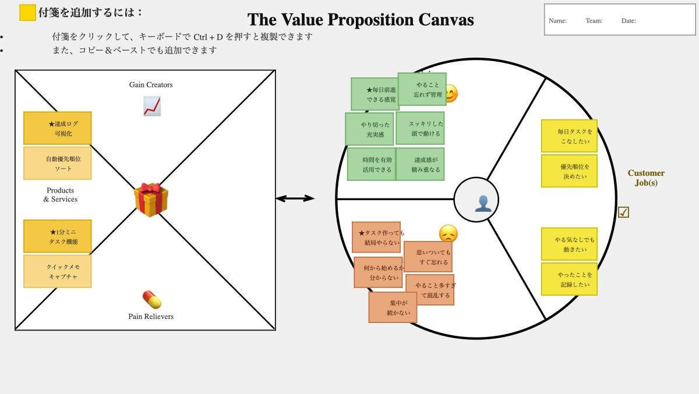

# VPC v1 - zhengshishaoki

> 「**自分や周りの人を顧客に設定**」したVPC。13週後の自分が欲しいもの・身近な人のために作りたいものを設計する。
> v1 でいい。完璧を目指さない。第6回でアップデート(v2)します。

---

## 1. 解決したい困りごとを 1つ 選ぶ

**選んだ困りごと**:

10. ★ 毎日やること作ってるのにやる気出なくてやらなくなることが多い

---

## 2. その解決策のアイデアを書く

**解決のアイデア**:

タスクを「やらなければならないもの」ではなく「1分でも触れればOK」にして、行動のハードルを下げるアプリ。やるたびに達成ログが積み上がるので、続いている実感が得られる。

---

## 3. VPC本体

### 🟦 Customer Profile（顧客 = 自分自身）

#### Jobs（やりたいこと・動詞で書く）

- 毎日のタスクを無理なくこなしたい
- 優先順位を自分で決めてスッキリ動きたい
- やる気がなくても最低限の行動を起こしたい
- やったことを記録して自信にしたい

#### Pains（困っていること）

- ★ タスクリストを作っても結局やらなくなる
- 頭の中でやることを思いついてもすぐ忘れる
- 何から手をつければいいか分からず止まる
- やることが多すぎて頭が混乱する
- 集中が続かず途中で離脱してしまう

#### Gains（得たい未来・状態）

- ★ 毎日「今日も少し前進した」と感じられる
- やることを忘れずに管理できている
- タスクをやり切ったあとの充実感がある
- スッキリした頭で次のことに取り組める
- 時間を有効に使えている実感がある
- 小さな達成感が積み重なってモチベになる

---

### 🟧 Value Map（あなたが作るもの）

#### Products & Services

- タスク管理アプリ（1分ミニタスク × 達成ログ型）

#### Pain Relievers

- ★ 「1分だけやる」ミニタスク機能（やる気ゼロでも始められる）
- クイックメモキャプチャ（思いついた瞬間にすぐ記録）

#### Gain Creators

- ★ 毎日の達成ログ可視化（続いてる実感を積み上げる）
- 自動優先順位ソート（何から始めるか迷わせない）

---

## 4. Fit確認（整合チェック）

| Pains / Gains | ↔ | Pain Relievers / Gain Creators | チェック |
|---|---|---|---|
| タスク作っても結局やらない | ↔ | 1分ミニタスク機能 | ✓ |
| 思いついてもすぐ忘れる | ↔ | クイックメモキャプチャ | ✓ |
| 毎日前進した感覚が欲しい | ↔ | 達成ログ可視化 | ✓ |
| 何から始めるか分からず止まる | ↔ | 自動優先順位ソート | ✓ |
